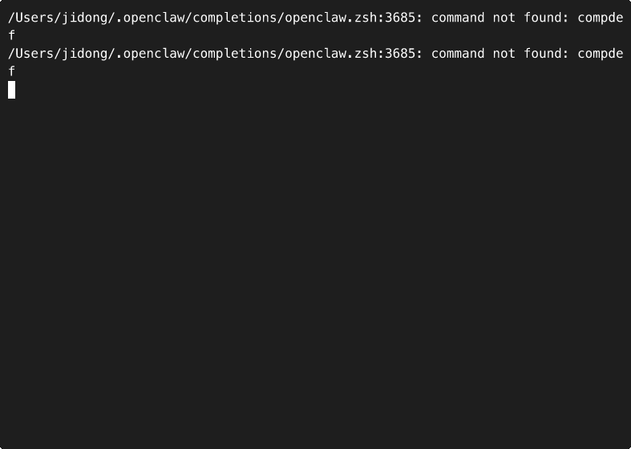

<h1 align="center">
  <br>
  🐦 AgentCrow
  <br>
</h1>

<h3 align="center">
  输入一个 prompt，AgentCrow 自动拆分到专业 Agent 并行执行。9 个内置 + 外部 Agent。<br>
  <code>agentcrow init</code> → <code>claude</code> → 自动调度。
</h3>

<p align="center">
  <a href="https://www.npmjs.com/package/agentcrow"></a>
  
  
  <a href="LICENSE"></a>
</p>

<p align="center">
  <a href="../README.md">English</a> •
  <a href="README.ko.md">한국어</a> •
  <a href="README.ja.md">日本語</a> •
  中文 •
  <a href="README.es.md">Español</a> •
  <a href="README.pt.md">Português</a> •
  <a href="README.de.md">Deutsch</a> •
  <a href="README.fr.md">Français</a> •
  <a href="README.ru.md">Русский</a> •
  <a href="README.hi.md">हिन्दी</a> •
  <a href="README.tr.md">Türkçe</a> •
  <a href="README.vi.md">Tiếng Việt</a>
</p>

---

<p align="center">
  
</p>

---

```
  你:    "做一个AI股票分析工具，能爬取数据、分析趋势、生成报告"

  AgentCrow 自动分解 → 5 个 Agent:

    🤖  ai_engineer         → 趋势预测模型、情感分析
    📊  data_pipeline_eng   → 股票API爬取、数据清洗、存储
    🖥️  frontend_developer  → 图表仪表盘、实时行情UI
    🏗️  backend_architect   → 数据API、用户认证、报告生成
    🧪  qa_engineer         → 数据准确性测试、API压力测试

  Claude 自动调度每个 Agent。
```

<h3 align="center">⬇️ 一行命令，搞定。</h3>

```bash
npm i -g agentcrow
agentcrow init
```

<p align="center">
  然后像平时一样运行 <code>claude</code> 就行。剩下的交给 AgentCrow。<br>
  <b>macOS · Linux · Windows</b>
</p>

---

## 👀 Before / After

<table>
<tr>
<td width="50%">

**❌ 没有 AgentCrow**
```
你: 做一个 Dashboard，
    包含 API、测试和文档。

Claude:（一个 Agent 干所有事）
        - 读所有文件
        - 写所有代码
        - 跑所有测试
        - 写所有文档
        = 一个上下文窗口
        = 忘掉前面的工作
        = 10 分钟以上
```

</td>
<td width="50%">

**✅ 使用 AgentCrow**
```
你: 同样的 prompt

AgentCrow 自动调度:
  @ui_designer     → 布局
  @frontend_dev    → React 代码
  @backend_arch    → API
  @qa_engineer     → 测试
  @tech_writer     → 文档

  = 并行 Agent
  = 各自专注擅长领域
  = 更好的结果
```

</td>
</tr>
</table>

---

<a id="install"></a>
## ⚡ 安装

```bash
npm i -g agentcrow
agentcrow init
```

就这么简单。它做两件事：

**首次运行** — 将 Agent 下载到 `~/.agentcrow/`（全局存储，所有项目共享）

**每次运行** — 将 AgentCrow 部分合并到 `.claude/CLAUDE.md`（你现有的规则保持不变）

> [!NOTE]
> Agent 全局存储在 `~/.agentcrow/`。第二个项目开始无需下载，即时完成。

> [!TIP]
> 已经有 CLAUDE.md？AgentCrow 只会**追加**自己的部分 — 你现有的规则不会被修改。

<a id="how-it-works"></a>
## ⚙️ 工作原理

```
  ┌─────────────────────────────────────┐
  │  Your prompt                        │
  │           ↓                         │
  │  ┌────────────────────────────┐     │
  │  │ CLAUDE.md reads agent list │     │
  │  │ Claude decomposes prompt   │     │
  │  │ Dispatches Agent tool      │     │
  │  │ Each agent works in scope  │     │
  │  └────────────────────────────┘     │
  │           ↓                         │
  │  Files created, tests written,      │
  │  docs generated — by specialists    │
  └─────────────────────────────────────┘
```

1. **在已初始化 AgentCrow 的项目中运行 `claude`**
2. **输入一个复杂的 prompt**
3. **Claude 读取 CLAUDE.md** — 获取 Agent 列表和调度规则
4. **Claude 分解任务** — 将 prompt 拆分为多个专注的子任务
5. **Claude 调度 Agent** — 通过 Agent 工具生成子 Agent
6. **每个 Agent 各司其职** — 在自己的专业领域内工作

不需要 API Key。不需要服务器。只需 Claude Code + CLAUDE.md。

<a id="agents"></a>
## 🤖 9 个内置 Agent + 外部 Agent

| 部门 | 示例 |
|:---------|:---------|
| **Engineering** | frontend_developer, backend_architect, ai_engineer, sre |
| **Game Dev** | game_designer, level_designer, unreal, unity, godot |
| **Marketing** | content_strategist, seo_specialist, social_media |
| **Testing** | test_automation, performance_tester |
| **Design** | ui_designer, ux_researcher, brand_guardian |
| **Builtin** | qa_engineer, korean_tech_writer, security_auditor |
| + more | sales, support, product, strategy, spatial-computing... |

<a id="commands"></a>
## 🔧 命令

```bash
agentcrow init                # 设置 Agent + CLAUDE.md（当前项目）
agentcrow init --global       # 一次设置，所有项目生效
agentcrow init --lang ko      # 韩文模板
agentcrow init --max 5        # 每次调度最大 Agent 数
agentcrow status              # 状态检查（项目 + 全局）
agentcrow off [--global]      # 临时禁用
agentcrow on [--global]       # 重新启用
agentcrow agents              # 列出所有 Agent
agentcrow agents search ai    # 按关键词搜索
agentcrow compose "prompt"    # 预览分解（dry run）
```

## 💡 Prompt 示例

```
做一个AI股票分析工具，能爬取数据、分析趋势、生成报告
→ ai_engineer + data_pipeline_engineer + frontend_developer + backend_architect

在线教育平台，支持视频课程、测验和证书
→ frontend_developer + backend_architect + ai_engineer + qa_engineer

社区论坛系统，支持帖子、评论、搜索和用户等级
→ frontend_developer + backend_architect + ui_designer + qa_engineer
```

简单的 prompt 会正常运行，AgentCrow 只在多任务请求时才会介入。

## 🛡️ 零开销

| | |
|:---|:---|
| 🟢 复杂 prompt | 自动拆分为多个 Agent |
| 🔵 简单 prompt | 正常运行，不启动 Agent |
| 🔴 `agentcrow off` | 完全禁用 |

> [!IMPORTANT]
> AgentCrow 只触碰 `.claude/CLAUDE.md` 和 `.claude/agents/`。没有依赖，没有后台进程。`agentcrow off` 会备份并完全移除两者。

## 🤝 贡献

```bash
git clone --recursive https://github.com/jee599/agentcrow.git
cd agentcrow && npm install && npm test  # 118 tests
```

## 📜 许可证

MIT — 外部 Agent 来源：[agency-agents](https://github.com/msitarzewski/agency-agents)。

---

<p align="center">
  <b>🐦 一个 Prompt。多个 Agent。零配置。</b>
</p>

<p align="center">
  <a href="https://github.com/jee599/agentcrow">
    
  </a>
</p>
